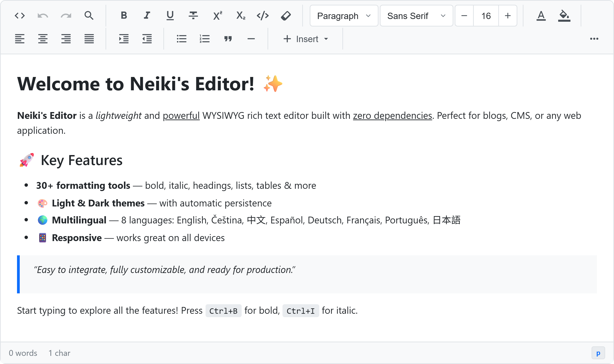
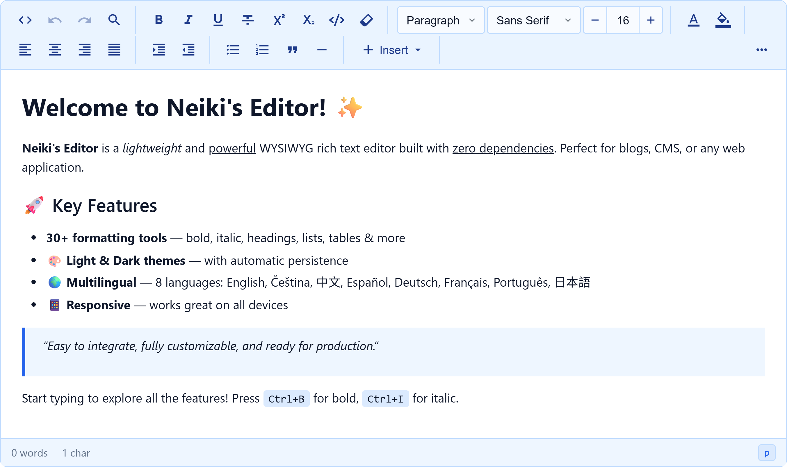
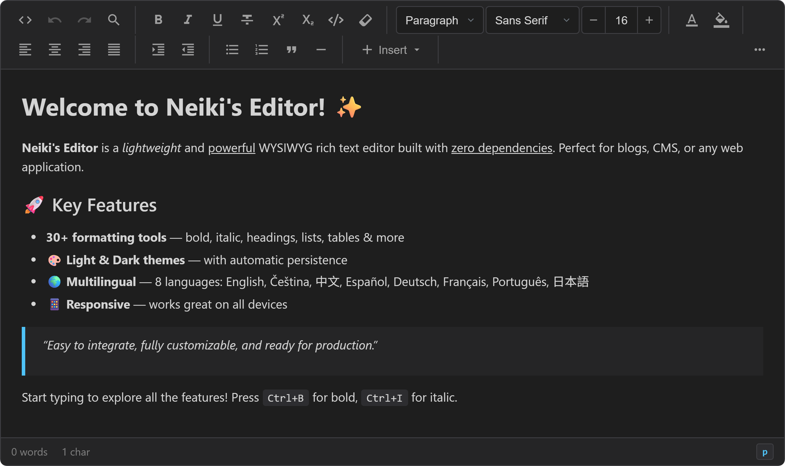
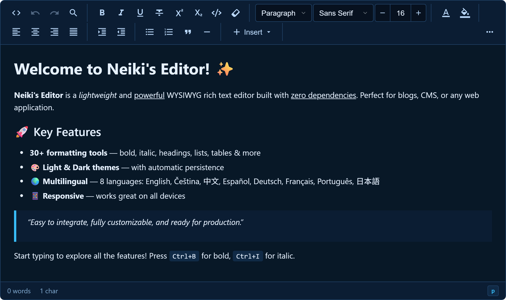
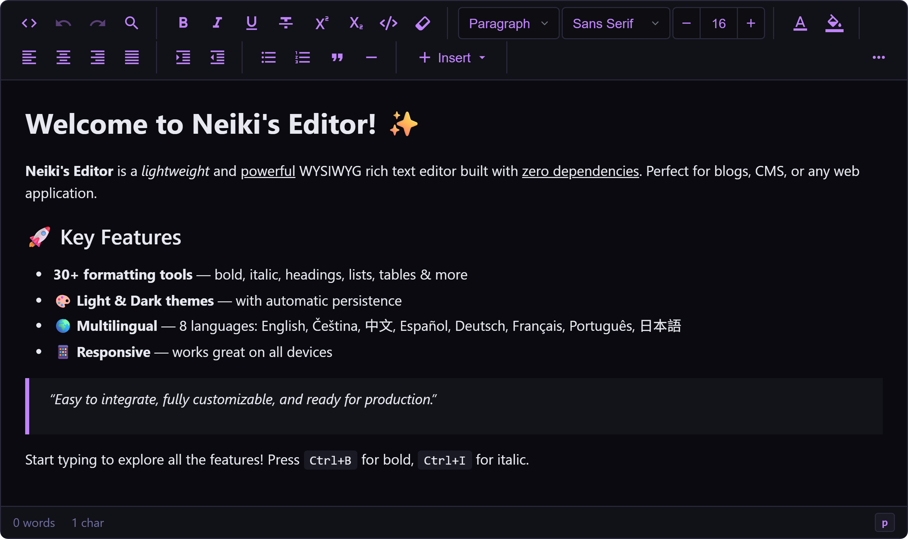
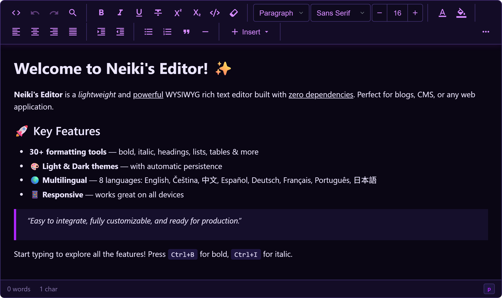
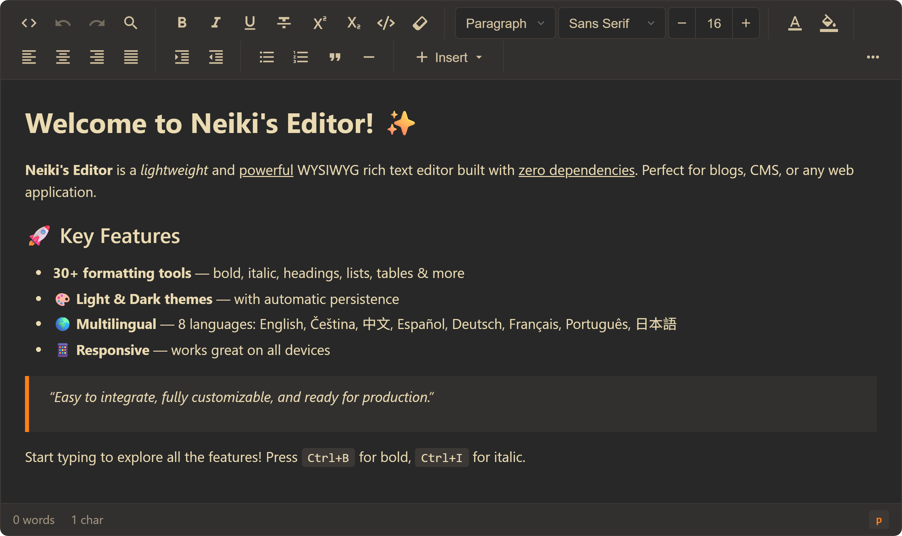
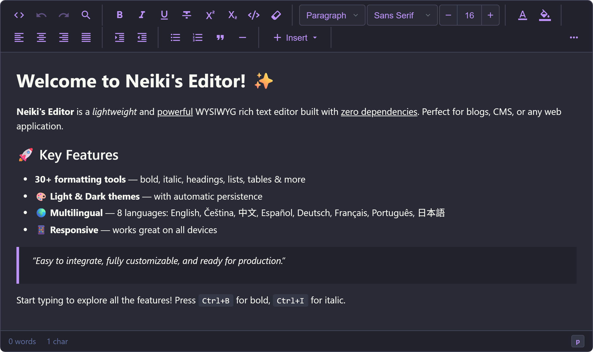

<p align="center">
  
</p>

<h1 align="center">Neiki's Editor</h1>

<p align="center">
  
  
  
  
  <br>
  
  
</p>

<p align="center">
  <b>Lightweight WYSIWYG Rich Text Editor</b><br>
  <i>Easy to integrate, fully customizable, zero dependencies.</i>
</p>

<p align="center">
  
  
  
  
</p>

<p align="center">
  <a href="https://sourceforge.net/projects/neiki-editor/files/latest/download"></a>
</p>

---

<p align="center">
  
</p>

<p align="center">
  
  
  
  
  
  
  
</p>

---

**Live version:** [https://neikiri.dev/editor](https://neikiri.dev/editor) · **Documentation:** [Wiki](https://github.com/neikiri/neiki-editor/wiki)

---

## Overview

Neiki's Editor is a WYSIWYG rich text editor written in plain JavaScript with **zero dependencies**. You attach it to an existing `<textarea>` (or any element), and it becomes a full editing surface — toolbar, formatting tools, tables, images, video, and a status bar — without pulling in a framework or a build step.

```html
<textarea id="editor"></textarea>
<script src="https://cdn.neikiri.dev/neiki-editor/neiki-editor.min.js"></script>
<script>
  const editor = new NeikiEditor('#editor');
</script>
```

That snippet is a complete, working editor. The minified build bundles its own CSS, so a single `<script>` tag is enough to get started. From there you can configure the toolbar, switch themes, wire up callbacks, and extend behaviour through the plugin API.

---

## Why Neiki's Editor?

Most rich text editors ask you to make a trade-off: either pull in a dependency tree and a bundler, or commit to a specific framework. Neiki's Editor avoids that trade-off.

- **One file, no dependencies.** The editor ships as a single script. The minified build embeds its CSS, so there is nothing else to install, import, or bundle. Drop it into a static page, a PHP template, or a SPA component — it behaves the same way.
- **Zero-config by default, configurable when you need it.** `new NeikiEditor('#editor')` gives you the full toolbar immediately. Every option is optional, so you only reach for configuration when you actually want to change something.
- **Real editing features, not just bold and italic.** Tables with a context menu and column resizing, image resize handles, drag-and-drop block reordering, a floating selection toolbar, find & replace with regex, an HTML source view, autosave, fullscreen, and print are all built in.
- **Built-in sanitization.** All HTML entering the editor is sanitized client-side, and the bundled PHP helper exposes a server-side `sanitize()` method. Security is treated as part of the editor, not an afterthought (see [Security](#security-notes)).
- **Framework-friendly without being framework-bound.** It works with plain HTML, and the docs include patterns for React, Vue 2/3, Laravel Blade, and AJAX workflows. A `destroy()` method makes clean teardown in SPA components straightforward.
- **Localized out of the box.** Eight UI languages are bundled, and you can override or add translations with your own keys.

If you want a content editor that you can read, host, and reason about as a single file — while still getting the features a production CMS needs — that is the gap this project fills.

---

## Features

### Text formatting

- Bold, italic, underline, strikethrough, subscript, superscript
- Inline `<code>` and `<pre><code>` code blocks
- Remove formatting
- Headings (Paragraph, H1–H6), font family, and a font-size widget with `−` / `+` controls and presets
- Text color and background color pickers (preset palette, native color input, hex input)

> When no text is selected, formatting commands automatically apply to the word at the cursor.

### Structure and content blocks

- Bulleted and numbered lists, indent / outdent
- Left, center, right, and justify alignment
- Blockquotes and horizontal rules
- **Tables** — configurable rows/columns and optional header row, a right-click context menu (insert/delete rows and columns, delete table, merge and split cells), and drag-to-resize columns
- **Images** — insert by URL, file upload, drag & drop, or clipboard paste; resize via corner handles with a live size label; edit URL, alt text, or width, replace, or delete from a contextual image toolbar
- **Video** — insert by URL, file upload, or drag & drop; rendered as `<video controls>`, resizable like images, and editable from its contextual toolbar

### Editing experience

- **Right-click context menu** — on desktop, Undo, Redo, Cut, Copy, Paste, **Paste as Plain Text**, Select All, and Remove Formatting, themed to match the active editor theme; touch input uses the browser's native context menu to preserve long-press selection controls
- **Floating toolbar** that appears on text selection (move block up/down, bold, italic, underline, strikethrough, insert link)
- **Block drag & drop** reordering using a grip handle in a dedicated left gutter, with ghost preview and drop placeholder
- **Find & Replace** in a draggable, non-modal panel with case-sensitive and regular-expression modes
- **HTML source view** with syntax highlighting, preserved visual scroll position, and optional third-party code-editor integration that preserves supported custom block attributes
- Undo / redo, autosave to `localStorage`, fullscreen mode, content preview, download as HTML, and print
- Status bar showing word count, character count, and the current block type

### Developer features

- Zero dependencies, single-file drop-in
- Plugin API for custom toolbar buttons and init hooks
- PHP integration helper with asset loading, rendering, and HTML sanitization
- Eight built-in UI languages: `en`, `cs`, `zh`, `es`, `de`, `fr`, `pt`, `ja`
- Eight built-in themes: Light, Dark, Blue, Dark Blue, Midnight, Void, Autumn, Dracula
- Lifecycle callbacks: `onReady`, `onChange`, `onSave`, `onFocus`, `onBlur`

---

## Getting started

The recommended install is the single bundled script from the CDN. CSS is included automatically.

```html
<script src="https://cdn.neikiri.dev/neiki-editor/neiki-editor.min.js"></script>
```

<details>
<summary><b>Other installation options</b> (pinned version, separate CSS/JS, jsDelivr, npm, self-hosted)</summary>
<br>

**Pin a specific version**

```html
<script src="https://cdn.neikiri.dev/neiki-editor/3.10.0/neiki-editor.min.js"></script>
```

**Load CSS and JS separately**

```html
<!-- Latest -->
<link rel="stylesheet" href="https://cdn.neikiri.dev/neiki-editor/neiki-editor.css">
<script src="https://cdn.neikiri.dev/neiki-editor/neiki-editor.js"></script>

<!-- Or pinned -->
<link rel="stylesheet" href="https://cdn.neikiri.dev/neiki-editor/3.10.0/neiki-editor.css">
<script src="https://cdn.neikiri.dev/neiki-editor/3.10.0/neiki-editor.js"></script>
```

**Alternative CDN — jsDelivr**

```html
<script src="https://cdn.jsdelivr.net/gh/neikiri/neiki-editor@latest/dist/neiki-editor.min.js"></script>
<!-- Pinned -->
<script src="https://cdn.jsdelivr.net/gh/neikiri/neiki-editor@3.10.0/dist/neiki-editor.min.js"></script>
```

**Package manager**

```bash
npm install neiki-editor
# or
yarn add neiki-editor
# or
pnpm add neiki-editor
```

**Self-hosted**

```html
<script src="path/to/neiki-editor.min.js"></script>

<!-- Or separate files -->
<link rel="stylesheet" href="path/to/neiki-editor.css">
<script src="path/to/neiki-editor.js"></script>
```

</details>

> **Note:** When using separate CSS and JS files, load the CSS **before** the JS so the editor renders correctly during initialization.

---

## Basic usage

Attach the editor to a `<textarea>`. Any HTML already inside the element is loaded automatically.

```html
<textarea id="editor"><p>Hello, world!</p></textarea>

<script>
  const editor = new NeikiEditor('#editor');
</script>
```

The editor can also be attached to a `<div>` with existing content, or to a DOM element reference, and multiple editors can coexist on the same page:

```javascript
const editor1 = new NeikiEditor('#editor-1', { theme: 'light' });
const editor2 = new NeikiEditor('#editor-2', { theme: 'dark', minHeight: 200 });
```

### Getting content back

```javascript
const html = editor.getContent();   // HTML string
const text = editor.getText();      // plain text, tags stripped
const empty = editor.isEmpty();     // boolean
const json = editor.getJSON();      // structured JSON
```

### Saving on form submit

```javascript
const editor = new NeikiEditor('#editor');

document.getElementById('my-form').addEventListener('submit', function (e) {
  e.preventDefault();
  const content = editor.getContent();
  // send `content` to your backend...
});
```

---

## Configuration

All options are optional. Pass them as the second argument to the constructor.

```javascript
const editor = new NeikiEditor('#editor', {
  placeholder: 'Start typing...',
  minHeight: 300,
  maxHeight: 600,
  theme: 'light',     // 'light' | 'dark' | 'blue' | 'dark-blue' | 'midnight' | 'void' | 'autumn' | 'dracula'
  language: 'en',     // 'en' | 'cs' | 'zh' | 'es' | 'de' | 'fr' | 'pt' | 'ja'
  onChange: function (content, editor) {
    console.log('Content changed:', content);
  }
});
```

### Options

| Option | Type | Default | Description |
|--------|------|---------|-------------|
| `placeholder` | `string` | `'Start typing...'` | Ghost text shown when the editor is empty |
| `minHeight` | `number` | `300` | Minimum height in pixels |
| `maxHeight` | `number \| null` | `null` | Maximum height in pixels (enables scroll). When `null`, the toolbar uses `position: sticky` while scrolling |
| `autofocus` | `boolean` | `false` | Focus the editor on initialization |
| `spellcheck` | `boolean` | `true` | Enable browser spellcheck |
| `readonly` | `boolean` | `false` | Make the editor read-only |
| `theme` | `string` | `'light'` | `'light'`, `'dark'`, `'blue'`, `'dark-blue'`, `'midnight'`, `'void'`, `'autumn'`, or `'dracula'` |
| `language` | `string` | `'en'` | UI language (see list above) |
| `translations` | `object \| null` | `null` | Custom translation keys, merged with built-ins |
| `contextMenu` | `boolean` | `true` | Enable the custom desktop right-click context menu. Touch input always retains the browser's native menu for long-press selection; set to `false` to use the native menu everywhere |
| `autosaveKey` | `string \| null` | `null` | Custom `localStorage` scope for autosave |
| `customClass` | `string \| null` | `null` | Custom content style class that replaces the default `neiki-content-default-style` class |
| `toolbar` | `array` | *(full set)* | Toolbar button configuration |
| `floatingToolbar` | `array \| false` | *(full set)* | Floating selection toolbar button configuration; set to `false` to disable it |
| `showHelp` | `boolean` | `true` | Show the Help item in the More menu (⋯) |
| `imageUploadHandler` | `function \| null` | `null` | Async `(file) => Promise<url>` for server/CDN image uploads instead of base64 |
| `videoUploadHandler` | `function \| null` | `null` | Async `(file) => Promise<url>` for server/CDN video uploads instead of base64 |
| `viewCodeEditor` | `object \| function \| null` | `null` | Third-party source-editor adapter or `(container, initialValue, editor) => adapter` factory; adapter implements `getValue()` and `setValue(value)` |
| `onChange` | `function \| null` | `null` | Fired on every content change |
| `onSave` | `function \| null` | `null` | Fired on save (Ctrl+S or More → Save) |
| `onFocus` | `function \| null` | `null` | Fired when the editor gains focus |
| `onBlur` | `function \| null` | `null` | Fired when the editor loses focus |
| `onReady` | `function \| null` | `null` | Fired once the editor is fully initialized |

> The `language` option is read at initialization. Changing the UI language at runtime requires re-initializing the editor.

### Customizing the toolbar

The `toolbar` option takes an array of button identifiers. Use `'|'` to add a visual separator; groups between separators wrap together as units on narrow screens.

```javascript
new NeikiEditor('#editor', {
  toolbar: [
    'bold', 'italic', 'underline', '|',
    'heading', 'fontSize', '|',
    'bulletList', 'numberedList', '|',
    'insertDropdown', '|',
    'moreMenu'
  ]
});
```

Available identifiers include text formatting (`bold`, `italic`, `underline`, `strikethrough`, `subscript`, `superscript`, `code`, `formatPainter`, `removeFormat`), style (`heading`, `fontFamily`, `fontSize`, `foreColor`, `backColor`), alignment and lists (`alignLeft`, `alignCenter`, `alignRight`, `alignJustify`, `bulletList`, `numberedList`, `indent`, `outdent`), structure (`blockquote`, `horizontalRule`), tools (`undo`, `redo`, `findReplace`, `viewCode`), the grouped `insertDropdown`, the right-aligned `moreMenu`, and a standalone `themeToggle`. See the [Toolbar Reference](https://github.com/neikiri/neiki-editor/wiki/Toolbar-Reference) for the full list.

### Customizing the floating toolbar

The `floatingToolbar` option controls the toolbar shown for desktop text selections. It accepts `moveUp`, `moveDown`, `bold`, `italic`, `underline`, `strikethrough`, `link`, and `'|'` separators. Omit an item to remove it, or set the option to `false` to disable the floating toolbar completely. On touch-first devices, the editor automatically leaves selection controls to the browser so the floating toolbar does not overlap the native long-press menu.

```javascript
new NeikiEditor('#editor', {
  floatingToolbar: ['bold', 'italic', 'underline', 'strikethrough']
});
```

### Custom source-code editor

The built-in source view preserves its scroll position and does not steal focus when opened. To use a third-party editor, pass either an adapter or a factory. A factory receives the source-view container, the initial formatted HTML, and the Neiki editor instance; it must return an adapter with `getValue()` and `setValue(value)` methods. `destroy()` is called on the adapter when the Neiki's Editor is destroyed, when available.

```javascript
new NeikiEditor('#editor', {
    viewCodeEditor: function(container, initialValue) {
        const codeEditor = createEditor(container, {
            language: 'xml',
            value: initialValue
        });

        return {
            getValue: () => codeEditor.getValue(),
            setValue: (value) => codeEditor.setValue(value),
            focus: () => codeEditor.focus?.(),
            destroy: () => codeEditor.destroy?.()
        };
    }
});
```

The adapter layer keeps Neiki's Editor independent of any specific editor package while ensuring changes made in source mode are applied when it closes.

### Themes

Eight themes ship by default: `light`, `dark`, `blue`, `dark-blue`, `midnight`, `void` (a dark purple cyberpunk theme with neon-purple glow accents), `autumn` (a warm retro theme with a brown background and orange accents), and `dracula` (the official [Dracula theme](https://draculatheme.com) — a dark purple-blue palette with pink, purple, green, and yellow accents). Set one at init or change it at runtime:

```javascript
const editor = new NeikiEditor('#editor', { theme: 'dark' });

editor.setTheme('dracula');  // set a specific theme
editor.toggleTheme();        // cycle: light → dark → blue → dark-blue → midnight → void → autumn → dracula → light
```

> The selected theme is persisted to `localStorage` as a **global** setting. It applies to all editor instances on the page and persists across reloads. If a user has already chosen a theme, that saved preference takes priority over the `theme` config value — call `setTheme()` after init if you need to override it.

### Custom content styling

By default, the editable area uses the internal `neiki-content` class plus the default typography class `neiki-content-default-style`. Use `customClass` to replace only the default typography class while keeping the internal editor class:

```javascript
new NeikiEditor('#editor', { customClass: 'article-content' });
```

That renders the content area with `class="neiki-content article-content"` instead of `class="neiki-content neiki-content-default-style"`.

```css
.article-content {
  font-family: Georgia, serif;
  font-size: 18px;
  line-height: 1.8;
}
```

### Localization

Eight languages are bundled: English (`en`, default), Czech (`cs`), Chinese (`zh`), Spanish (`es`), German (`de`), French (`fr`), Portuguese (`pt`), and Japanese (`ja`). Override or extend any string via `translations`, or register a language globally:

```javascript
// Inline overrides (merged with built-ins)
new NeikiEditor('#editor', {
  language: 'en',
  translations: {
    'toolbar.bold': 'Make it bold',
    'placeholder': 'Start your story...'
  }
});

// Or register globally
NeikiEditor.addTranslation('de', {
  'toolbar.bold': 'Fett (Strg+B)'
});
```

### Autosave

Autosave is toggled from the More menu (⋯). When enabled, content is written to `localStorage` on change and restored on the next page load (only while autosave is still enabled). Keys are scoped by page URL and editor identity; use `autosaveKey` to isolate drafts when the same URL edits different records:

```javascript
new NeikiEditor('#editor', { autosaveKey: 'article-42' });
```

You can clear saved autosave data for the current editor, remove a specific scoped storage key, or remove all scoped keys matching a prefix:

```javascript
editor.clearAutosaveStorage();                 // current editor's autosave flags/content
editor.removeStorage('autosave_content');      // current editor storage key
editor.removeStorageByPrefix('autosave_');     // current editor storage keys by prefix

NeikiEditor.removeStorageKey('neiki_autosave_article-42_autosave_content');
NeikiEditor.removeStorageByPrefix('neiki_autosave_');
NeikiEditor.clearAutosaveStorage();            // shortcut for the default autosave prefix
```

> Autosave is intended for drafts and recovery. For production persistence, use the `onSave` or `onChange` callbacks to save to your backend.

---

## API

Methods are called on the editor instance unless noted as static.

```javascript
// Content
editor.getContent();                 // HTML string  (alias: getHTML)
editor.setContent('<p>Hello</p>');   //              (alias: setHTML)
editor.getText();                    // plain text
editor.isEmpty();                    // boolean
editor.getJSON();                    // structured JSON
editor.setJSON(json);
editor.insertHTML('<mark>hi</mark>');// insert at cursor
editor.clearAll();

// Selection
editor.getSelection();
editor.wrapSelection('mark', { class: 'highlight' });
editor.unwrapSelection('mark');

// Control
editor.focus();
editor.blur();
editor.enable();
editor.disable();
editor.destroy();                    // remove editor, restore original element
editor.toggleFullscreen();
editor.triggerSave();                // trigger onSave
editor.previewContent();             // open preview modal
editor.createModal('<div class="neiki-modal-body">Custom content</div>');
editor.closeModal();
editor.downloadContent();            // download as .html

// Storage cleanup
editor.clearAutosaveStorage();
editor.removeStorage('autosave_content');
editor.removeStorageByPrefix('autosave_');

// Theme
editor.setTheme('dark');
editor.toggleTheme();

// Commands
editor.execCommand('bold');
editor.execCommand('foreColor', '#ff0000');

// Static (plugins)
NeikiEditor.registerPlugin({ /* ... */ });
NeikiEditor.getPlugins();            // array of registered plugins
NeikiEditor.addTranslation('de', { /* ... */ });
NeikiEditor.removeStorageKey('neiki_autosave_article-42_autosave_content');
NeikiEditor.removeStorageByPrefix('neiki_autosave_');
NeikiEditor.clearAutosaveStorage();
```

> In SPA frameworks, always call `editor.destroy()` when the component unmounts to clean up listeners and avoid memory leaks.

Useful instance properties include `editor.contentArea` (the `contenteditable` element) and `editor.toolbar` (the toolbar element), which are handy inside plugin `init` hooks. See the full [API Reference](https://github.com/neikiri/neiki-editor/wiki/API-Reference).

### Plugin API

Register a plugin globally to add a custom toolbar button and/or run code when the editor initializes. Reference the plugin by its `name` in the `toolbar` array.

```javascript
NeikiEditor.registerPlugin({
  name: 'word-counter',                                   // required, unique
  icon: '<svg viewBox="0 0 24 24">...</svg>',             // optional toolbar icon
  tooltip: 'Show Word Count',                             // optional
  action: function (editor) {                             // optional, on click
    const words = editor.getText().trim().split(/\s+/).filter(Boolean).length;
    alert('Word count: ' + words);
  },
  init: function (editor) {                               // optional, runs once
    console.log('Plugin initialized!');
  }
});

new NeikiEditor('#editor', {
  toolbar: ['bold', 'italic', '|', 'word-counter', '|', 'moreMenu']
});
```

| Property | Type | Required | Description |
|----------|------|----------|-------------|
| `name` | `string` | Yes | Unique identifier, referenced in the toolbar array |
| `icon` | `string` | No | SVG markup for the toolbar button |
| `tooltip` | `string` | No | Hover tooltip text |
| `action` | `function(editor)` | No | Called when the button is clicked |
| `init` | `function(editor)` | No | Called once when the editor initializes |

---

## Keyboard shortcuts

| Shortcut | Action |
|----------|--------|
| Ctrl+B | Bold |
| Ctrl+I | Italic |
| Ctrl+U | Underline |
| Ctrl+K | Insert link |
| Ctrl+S | Save (triggers `onSave`) |
| Ctrl+Z | Undo |
| Ctrl+Y / Ctrl+Shift+Z | Redo |
| Tab / Shift+Tab | Indent / Outdent |

---

## Integration notes

### PHP helper (recommended for PHP apps)

The repository includes `php/neiki-editor.php`, a helper for asset loading, rendering, and sanitization.

```php
<?php require_once 'php/neiki-editor.php'; ?>
<head>
    <?= NeikiEditor::assets() ?>
</head>
<body>
    <form method="POST" action="save.php">
        <?= NeikiEditor::render('content', $article->body, [
            'minHeight'   => 400,
            'placeholder' => 'Write your article...'
        ]) ?>
        <button type="submit">Save</button>
    </form>
</body>
```

```php
// save.php — sanitize before saving to the database
require_once 'php/neiki-editor.php';
$clean = NeikiEditor::sanitize($_POST['content']);
$db->save($clean);
```

| Method | Description |
|--------|-------------|
| `NeikiEditor::assets()` | Output CDN CSS & JS tags. Call once per page. |
| `NeikiEditor::assets(true, '/path/to/dist')` | Use local files instead of the CDN. |
| `NeikiEditor::render($id, $content, $options)` | Render the textarea plus initialization script. |
| `NeikiEditor::sanitize($html)` | Strip dangerous tags/attributes before saving. |

### PHP form (manual)

If you prefer not to use the helper, render a plain `<textarea>` and initialize the editor yourself:

```php
<form method="POST" action="save.php">
    <textarea id="editor" name="content"><?= htmlspecialchars($article->content) ?></textarea>
    <button type="submit">Save</button>
</form>

<script>
    const editor = new NeikiEditor('#editor');
</script>
```

### React

```jsx
import { useEffect, useRef } from 'react';

function NeikiEditorComponent({ value, onChange }) {
  const ref = useRef(null);
  const editorRef = useRef(null);

  useEffect(() => {
    editorRef.current = new NeikiEditor(ref.current, {
      onChange: (content) => onChange?.(content)
    });
    if (value) editorRef.current.setContent(value);
    return () => editorRef.current?.destroy();
  }, []); // initialize once

  return <textarea ref={ref} defaultValue={value} />;
}
```

> Do not include `value` in the effect dependency array — that would recreate the editor on every keystroke. Update content imperatively with `setContent()` instead.

### Vue 3 (Composition API)

```vue
<template>
  <textarea ref="editorEl"></textarea>
</template>

<script setup>
import { ref, onMounted, onBeforeUnmount } from 'vue';

const props = defineProps({ modelValue: { type: String, default: '' } });
const emit = defineEmits(['update:modelValue']);
const editorEl = ref(null);
let editor = null;

onMounted(() => {
  editor = new NeikiEditor(editorEl.value, {
    onChange: (content) => emit('update:modelValue', content)
  });
  if (props.modelValue) editor.setContent(props.modelValue);
});

onBeforeUnmount(() => editor?.destroy());
</script>
```

### AJAX auto-save

```javascript
const editor = new NeikiEditor('#editor', {
  onChange: debounce(function (content) {
    fetch('/api/save', {
      method: 'POST',
      headers: { 'Content-Type': 'application/json' },
      body: JSON.stringify({ content })
    });
  }, 2000)
});
```

The wiki also includes a [Laravel Blade](https://github.com/neikiri/neiki-editor/wiki/Integration-Guide) example and a full integration checklist.

---

## Security notes

Neiki's Editor sanitizes all HTML that enters the editor (textarea content, `setContent()`, `insertHTML()`, and autosave restoration). The client-side sanitizer strips dangerous tags such as `<script>` and `<iframe>`, removes event-handler attributes like `onclick` and `onerror`, and blocks `javascript:` protocol URLs.

> Client-side sanitization is defense-in-depth — it does **not** replace server-side sanitization. Always validate and sanitize submitted HTML on the server before storing it or showing it to other users. The bundled PHP helper provides `NeikiEditor::sanitize()` for this purpose.

A few additional considerations:

- **Autosave is not encrypted.** Content saved to `localStorage` is readable by any JavaScript on the same origin. Disable autosave for sensitive content and save to your backend instead.
- **Content Security Policy.** The editor applies inline styles for font sizes, colors, and image dimensions, so a strict CSP will need to allow `'unsafe-inline'` for `style-src` for those features to work. See the [Security](https://github.com/neikiri/neiki-editor/wiki/Security) page for example CSP directives.

---

## Documentation

Full documentation lives in the project wiki:

- [Home](https://github.com/neikiri/neiki-editor/wiki/Home)
- [Getting Started](https://github.com/neikiri/neiki-editor/wiki/Getting-Started)
- [Configuration](https://github.com/neikiri/neiki-editor/wiki/Configuration)
- [Toolbar Reference](https://github.com/neikiri/neiki-editor/wiki/Toolbar-Reference)
- [API Reference](https://github.com/neikiri/neiki-editor/wiki/API-Reference)
- [Plugin API](https://github.com/neikiri/neiki-editor/wiki/Plugin-API)
- [Integration Guide](https://github.com/neikiri/neiki-editor/wiki/Integration-Guide)
- [Advanced Features](https://github.com/neikiri/neiki-editor/wiki/Advanced-Features)
- [Themes & Styling](https://github.com/neikiri/neiki-editor/wiki/Themes-and-Styling)
- [Security](https://github.com/neikiri/neiki-editor/wiki/Security)

**Live demo:** [https://neikiri.dev/editor](https://neikiri.dev/editor)

---

## Browser support

Neiki's Editor uses `contentEditable` and standard DOM APIs and targets current versions of modern browsers.

| Browser | Support |
|---------|---------|
| Chrome | Latest |
| Firefox | Latest |
| Safari | Latest |
| Edge | Latest |
| Opera | Latest |

> Internet Explorer is not supported.

---

## Contributing

Contributions are welcome. Please review [CONTRIBUTING.md](CONTRIBUTING.md) and the [CODE_OF_CONDUCT.md](CODE_OF_CONDUCT.md) before opening an issue or pull request. Security-related reports should follow [SECURITY.md](SECURITY.md).

The editor source lives in `src/` (`neiki-editor.js`, `neiki-editor.css`); the distributable builds are in `dist/`.

---

## License

Released under the **GNU Affero General Public License v3.0** (`AGPL-3.0-or-later`). See the [LICENSE](LICENSE) file for details.

---

<p align="center">
  Made with ❤️ for the web community
</p>
