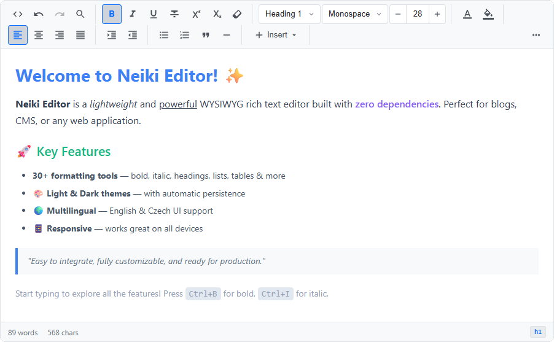

<p align="center">
  
</p>

<h1 align="center">Neiki's Editor</h1>

<p align="center">
  
  
  
  
  <br>
  
  
</p>

<p align="center">
  <b>Lightweight WYSIWYG Rich Text Editor</b><br>
  <i>Easy to integrate, fully customizable, zero dependencies.</i>
</p>

<p align="center">
  
  
  
  
</p>

<p align="center">
  <a href="https://oosmetrics.com/repo/neikiri/neiki-editor"></a>
  <a href="https://oosmetrics.com/repo/neikiri/neiki-editor"></a>
</p>

---
<p align="center">
  
</p>

---

**Live version:** [https://neikiri.dev/editor](https://neikiri.dev/editor)

---

## 💡 Why Neiki's Editor?

Most WYSIWYG editors either pull in a tree of dependencies or force you into a heavyweight framework. Neiki's Editor is a **single file with zero dependencies** — drop one `<script>` tag into any page and you get 30+ formatting tools, drag-and-drop blocks, image resizing, a plugin API, and full i18n out of the box. It stays tiny enough for a quick prototype yet powerful enough for a production CMS, so you spend time writing content instead of wrestling with your editor.

---
## 📦 Installation

Add this single line — CSS is included automatically, always the **latest version**:

```html
<script src="https://cdn.neikiri.dev/neiki-editor/neiki-editor.min.js"></script>
```

<details>
<summary><b>📋 More installation options</b> (pinned version, separate CSS/JS, jsDelivr, npm, self-hosted)</summary>
<br>

#### Pin a specific version

```html
<script src="https://cdn.neikiri.dev/neiki-editor/2.9.5/neiki-editor.min.js"></script>
```

#### Load CSS and JS separately

```html
<!-- Latest -->
<link rel="stylesheet" href="https://cdn.neikiri.dev/neiki-editor/neiki-editor.css">
<script src="https://cdn.neikiri.dev/neiki-editor/neiki-editor.js"></script>

<!-- Or pinned -->
<link rel="stylesheet" href="https://cdn.neikiri.dev/neiki-editor/2.9.5/neiki-editor.css">
<script src="https://cdn.neikiri.dev/neiki-editor/2.9.5/neiki-editor.js"></script>
```

#### Alternative CDN — jsDelivr

```html
<!-- Latest -->
<script src="https://cdn.jsdelivr.net/gh/neikiri/neiki-editor@latest/dist/neiki-editor.min.js"></script>

<!-- Pinned -->
<script src="https://cdn.jsdelivr.net/gh/neikiri/neiki-editor@2.9.5/dist/neiki-editor.min.js"></script>

<!-- Separate files (latest) -->
<link rel="stylesheet" href="https://cdn.jsdelivr.net/gh/neikiri/neiki-editor@latest/dist/neiki-editor.css">
<script src="https://cdn.jsdelivr.net/gh/neikiri/neiki-editor@latest/dist/neiki-editor.js"></script>

<!-- Separate files (pinned) -->
<link rel="stylesheet" href="https://cdn.jsdelivr.net/gh/neikiri/neiki-editor@2.9.5/dist/neiki-editor.css">
<script src="https://cdn.jsdelivr.net/gh/neikiri/neiki-editor@2.9.5/dist/neiki-editor.js"></script>
```

#### Package Manager

```bash
npm install neiki-editor
# or
yarn add neiki-editor
# or
pnpm add neiki-editor
```

#### Self-hosted

```html
<script src="path/to/neiki-editor.min.js"></script>

<!-- Or separate files -->
<link rel="stylesheet" href="path/to/neiki-editor.css">
<script src="path/to/neiki-editor.js"></script>
```

</details>

---

## 🚀 Quick Start

```html
<textarea id="editor"></textarea>

<script>
  const editor = new NeikiEditor('#editor');
</script>
```

That's it — zero config required. The editor replaces the `<textarea>` with a full-featured WYSIWYG editor.

---

## ⚙️ Configuration

```javascript
const editor = new NeikiEditor('#editor', {
    placeholder: 'Start typing...',
    minHeight: 300,
    maxHeight: 600,
    autofocus: false,
    spellcheck: true,
    readonly: false,
    theme: 'light',       // 'light' or 'dark'
    language: 'en',       // 'en', 'cs', or custom via addTranslation()
    translations: null,   // custom translation keys (merged with built-in)
    autosaveKey: null,    // optional custom localStorage scope for autosave
    custom_class: null,   // optional custom CSS class for the content area
    toolbar: [
        'viewCode', 'undo', 'redo', 'findReplace', '|',
        'bold', 'italic', 'underline', 'strikethrough', 'superscript', 'subscript', 'removeFormat', '|',
        'heading', 'fontFamily', 'fontSize', '|',
        'foreColor', 'backColor', '|',
        'alignLeft', 'alignCenter', 'alignRight', 'alignJustify', '|',
        'indent', 'outdent', '|',
        'bulletList', 'numberedList', 'blockquote', 'horizontalRule', '|',
        'insertDropdown', '|',
        'moreMenu'
    ],
    onChange: function(content, editor) {
        console.log('Content changed:', content);
    },
    onSave: function(content, editor) {
        console.log('Save triggered:', content);
    },
    onReady: function(editor) {
        console.log('Editor is ready!');
    }
});
```

### Configuration Options

| Option | Type | Default | Description |
|--------|------|---------|-------------|
| `placeholder` | `string` | `'Start typing...'` | Placeholder text when editor is empty |
| `minHeight` | `number` | `300` | Minimum height in pixels |
| `maxHeight` | `number\|null` | `null` | Maximum height in pixels (enables scroll). When `null`, the toolbar uses `position: sticky` to remain visible while scrolling. |
| `autofocus` | `boolean` | `false` | Focus editor on initialization |
| `spellcheck` | `boolean` | `true` | Enable browser spellcheck |
| `readonly` | `boolean` | `false` | Make editor read-only |
| `theme` | `string` | `'light'` | `'light'` or `'dark'` |
| `language` | `string` | `'en'` | UI language — `en`, `cs`, `zh`, `es`, `de`, `fr`, `pt`, `ja` |
| `translations` | `object\|null` | `null` | Custom translation keys (merged with built-in) |
| `autosaveKey` | `string\|null` | `null` | Custom `localStorage` scope for autosave content and enabled state |
| `toolbar` | `array` | *(see above)* | Toolbar button configuration |
| `onChange` | `function\|null` | `null` | Callback on content change |
| `onSave` | `function\|null` | `null` | Callback on save (triggered by Ctrl+S or More menu → Save) |
| `onFocus` | `function\|null` | `null` | Callback when editor gains focus |
| `onBlur` | `function\|null` | `null` | Callback when editor loses focus |
| `onReady` | `function\|null` | `null` | Callback when editor is ready |
| `showHelp` | `boolean` | `true` | Show Help button in More menu (⋯) |
| `imageUploadHandler` | `function\|null` | `null` | Async callback `(file) => Promise<url>` for uploading images to a server/CDN instead of base64 |
| `custom_class` | `string\|null` | `null` | Custom CSS class appended to the editor content area (`neiki-content`) |

---

## 🔧 Toolbar Buttons

Use the `toolbar` array to customize which buttons appear and in what order. Use `'|'` for a visual separator between groups. Groups of buttons between separators wrap as whole units on smaller screens.

### Text Formatting

| Button | Description |
|--------|-------------|
| `bold` | Bold text (**Ctrl+B**) |
| `italic` | Italic text (**Ctrl+I**) |
| `underline` | Underline text (**Ctrl+U**) |
| `strikethrough` | Strikethrough text |
| `subscript` | Subscript text |
| `superscript` | Superscript text |
| `removeFormat` | Remove all formatting |

> **Note:** When no text is selected, formatting commands (including Remove Formatting) automatically expand to the word at the cursor position.

### Text Style

| Button | Type | Description |
|--------|------|-------------|
| `heading` | Select | Paragraph, H1, H2, H3, H4, H5, H6. Defaults to Paragraph. |
| `fontSize` | Widget | Font size widget with **[−]** / **[+]** buttons, text input, and dropdown presets: 8, 9, 10, 11, 12, 14, 18, 24, 30, 36, 48, 60, 72, 96 |
| `fontFamily` | Select | Sans Serif (Arial), Serif (Georgia), Monospace (Consolas), Cursive (Comic Sans MS) |
| `foreColor` | Color Picker | Text color — palette, native color input, hex code input |
| `backColor` | Color Picker | Background color — palette, native color input, hex code input |

### Alignment & Lists

| Button | Description |
|--------|-------------|
| `alignLeft` | Align text left |
| `alignCenter` | Center text |
| `alignRight` | Align text right |
| `alignJustify` | Justify text |
| `bulletList` | Unordered list |
| `numberedList` | Ordered list |
| `indent` | Increase indent |
| `outdent` | Decrease indent |

### Insert Dropdown

The `insertDropdown` toolbar item renders a single **Insert** button that opens a dropdown containing:

| Item | Description |
|------|-------------|
| **Link** | Insert/edit hyperlink (**Ctrl+K**) |
| **Image** | Insert image (URL or file upload → base64) |
| **Table** | Insert table with custom rows/columns |
| **Emoji** | Emoji picker (100+ emojis) |
| **Symbol** | Special characters (©, ®, €, π, Ω, arrows, etc.) |

You can still use `link`, `image`, `table`, `emoji`, `specialChars` as standalone toolbar buttons if preferred.

### More Menu

The `moreMenu` toolbar item renders a **⋯** button (pushed to the right) that opens a dropdown containing:

| Item | Description |
|------|-------------|
| **Save** | Trigger the `onSave` callback |
| **Preview** | Open a document preview modal |
| **Download** | Download content as an HTML file |
| **Print** | Print editor content |
| **Autosave** | Toggle autosave to localStorage |
| **Clear all** | Clear all editor content |
| **Toggle Theme** | Switch between light/dark theme |
| **Fullscreen** | Toggle fullscreen mode |
| **Help** | Show help modal with author, version, and links (configurable via `showHelp`) |

### Standalone Tools

| Button | Description |
|--------|-------------|
| `undo` | Undo (**Ctrl+Z**) |
| `redo` | Redo (**Ctrl+Y** / **Ctrl+Shift+Z**) |
| `findReplace` | Find & Replace with regex support |
| `viewCode` | Toggle HTML source editor |
| `blockquote` | Block quote (toggles on/off) |
| `horizontalRule` | Horizontal line |

---

## 🎨 Themes

Neiki's Editor ships with **Light** and **Dark** themes.

### Set theme on init:

```javascript
const editor = new NeikiEditor('#editor', {
    theme: 'dark'
});
```

### Toggle theme at runtime:

Use the **Toggle Theme** item in the More menu (⋯), or toggle programmatically:

```javascript
editor.toggleTheme();
// or set a specific theme:
editor.setTheme('dark');
```

The selected theme persists across page reloads via `localStorage`.

---

## 🌍 Localization (i18n)

Neiki's Editor supports multiple UI languages. Built-in:

- **English** (`en`) — default
- **Czech** (`cs`)
- **Chinese** (`zh`)
- **Spanish** (`es`)
- **German** (`de`)
- **French** (`fr`)
- **Portuguese** (`pt`)
- **Japanese** (`ja`)

### Set language on init:

```javascript
const editor = new NeikiEditor('#editor', {
    language: 'cs'  // Czech UI
});
```

### Custom translations

Add your own language or override existing translations using the static method:

```javascript
NeikiEditor.addTranslation('de', {
    'toolbar.bold': 'Fett (Strg+B)',
    'toolbar.italic': 'Kursiv (Strg+I)',
    'toolbar.undo': 'Rückgängig (Strg+Z)',
    // only override what you need — English is the fallback
});

const editor = new NeikiEditor('#editor', { language: 'de' });
```

Or pass translations directly in config:

```javascript
const editor = new NeikiEditor('#editor', {
    language: 'de',
    translations: {
        de: {
            'toolbar.bold': 'Fett (Strg+B)',
            'toolbar.italic': 'Kursiv (Strg+I)',
            // ...
        }
    }
});
```

All toolbar tooltips, modal dialogs, status bar texts, and system messages are translatable.

---

## 💾 Autosave

Autosave is accessible from the **More menu** (⋯) in the default toolbar. When activated:

- Content is saved to `localStorage` on every content change (debounced)
- The status bar shows "Autosaving..." / "Saved locally"
- Content is restored on page reload **only when autosave was enabled**
- Autosave keys are scoped by page URL and editor identity by default, so multiple editors do not overwrite each other

For apps where the same URL can edit different records, pass a custom `autosaveKey`:

```javascript
new NeikiEditor('#editor', {
    autosaveKey: 'article-42'
});
```

> **Note:** For production use (CMS, blog, etc.), use the `onSave` callback or `onChange` callback to save content to your database instead.

---

## 📋 API Methods

### Content

```javascript
editor.getContent();          // Get HTML content
editor.setContent('<p>Hello</p>');  // Set HTML content
editor.getText();             // Get plain text content
editor.isEmpty();             // Check if editor is empty

editor.getHTML();             // Alias for getContent()
editor.setHTML(html);         // Alias for setContent()

editor.getJSON();             // Get structured JSON representation
editor.setJSON(json);         // Set content from JSON
```

### Editor Control

```javascript
editor.focus();               // Focus the editor
editor.blur();                // Blur the editor
editor.enable();              // Enable editing
editor.disable();             // Disable editing (read-only)
editor.destroy();             // Remove editor, restore original element
editor.toggleFullscreen();    // Toggle fullscreen mode
editor.toggleTheme();         // Toggle light/dark theme
editor.setTheme('dark');      // Set a specific theme
editor.triggerSave();         // Trigger onSave callback
editor.previewContent();      // Open preview modal
editor.downloadContent();     // Download content as HTML file
editor.clearAll();            // Clear all content
```

### Localization

```javascript
NeikiEditor.addTranslation('de', { ... });  // Add/override translations (static)
```

### Command Execution

```javascript
editor.execCommand('bold');                  // Execute a command
editor.insertHTML('<span>Hello</span>');     // Insert HTML at cursor
editor.wrapSelection('mark', { class: 'highlight' }); // Wrap selection
editor.unwrapSelection('mark');              // Unwrap selection
```

### Selection

```javascript
editor.getSelection();        // Get current Selection object
```

---

## 🔌 Plugin API

Extend the editor with custom plugins:

```javascript
NeikiEditor.registerPlugin({
    name: 'word-counter-alert',
    icon: '<svg viewBox="0 0 24 24">...</svg>',   // optional toolbar button
    tooltip: 'Show Word Count',
    action: function(editor) {
        const text = editor.getContent().replace(/<[^>]*>/g, '');
        const words = text.trim().split(/\s+/).filter(Boolean).length;
        alert('Word count: ' + words);
    },
    init: function(editor) {
        // Called once when editor initializes (optional)
        console.log('Plugin initialized!');
    }
});
```

### Plugin Properties

| Property | Type | Required | Description |
|----------|------|----------|-------------|
| `name` | `string` | ✅ | Unique plugin identifier |
| `icon` | `string` | ❌ | SVG icon for toolbar button |
| `tooltip` | `string` | ❌ | Button tooltip text |
| `action` | `function` | ❌ | Called when toolbar button is clicked |
| `init` | `function` | ❌ | Called once during editor initialization |

### List Registered Plugins

```javascript
NeikiEditor.getPlugins(); // Returns array of registered plugins
```

---

## 📊 Table Features

Insert tables via the toolbar button with configurable rows, columns, and optional header row.

### Table Context Menu

Right-click on any table cell to access:

- **Insert Row Above / Below**
- **Insert Column Left / Right**
- **Delete Row / Column / Table**
- **Merge Cells** — merge selected cells horizontally
- **Split Cell** — split a previously merged cell

### Column Resize

Hover near any column border to reveal a **drag handle**. Drag to resize adjacent column widths. The table uses fixed layout during resize for precise control.

---

## 🖼️ Image Support

### Insert via URL

Click the **Image** toolbar button and paste a URL.

### Upload from File

The Image dialog includes a file upload input. Selected images are converted to **base64** and embedded directly in the content.

### Drag & Drop

Drag image files directly into the editor content area. Images are automatically converted to base64 and inserted at the drop position.

### Resize Images

Click any image in the editor to select it — **resize handles** appear on all four corners. Drag any handle to resize while maintaining aspect ratio. A live **size label** (width × height) is displayed below the image during resizing.

### Image Toolbar

When an image is selected, a contextual toolbar appears above it with image-specific actions:

- **Drag handle** (⠿) — click and drag to reposition the image within the editor
- **Replace** — swap the image via a file picker (supports `imageUploadHandler` or base64)
- **Delete** — remove the selected image

The floating text-formatting toolbar is automatically hidden when an image is selected.

---

## 🔍 Find & Replace

Open with the toolbar button or implement via the modal API.

Features:
- **Case-sensitive** search toggle
- **Regular expression** support
- **Find Next** — navigate through matches with highlighting
- **Replace** — replace current match
- **Replace All** — replace all matches at once

---

## ✏️ Floating Toolbar

When you select text in the editor, a floating toolbar appears above the selection with quick access to:

- **Move Block Up / Down** — reorder the current content block (left side)
- **Bold, Italic, Underline, Strikethrough** — quick formatting
- **Insert Link**

The toolbar follows the selection and disappears when the selection is cleared. When an image is selected, the floating toolbar is replaced by an **image-specific toolbar** with relevant actions.

---

## 🔀 Block Drag & Drop

Hover over any content block (paragraph, heading, table, image, list, etc.) to reveal a **grip handle** (⠿) on the left side. Drag to reorder blocks within the editor. A ghost preview and drop placeholder guide the drop position.

---

## 🖨️ Print

Click the **Print** button to open the browser print dialog with the editor content formatted for printing.

---

## ⌨️ Keyboard Shortcuts

| Shortcut | Action |
|----------|--------|
| **Ctrl+B** | Bold |
| **Ctrl+I** | Italic |
| **Ctrl+U** | Underline |
| **Ctrl+K** | Insert Link |
| **Ctrl+S** | Save (triggers `onSave` callback) |
| **Ctrl+Z** | Undo |
| **Ctrl+Y** / **Ctrl+Shift+Z** | Redo |
| **Tab** | Indent |
| **Shift+Tab** | Outdent |

---

## 📐 Status Bar

The editor includes a status bar at the bottom displaying:

- **Left side:** Word count and character count
- **Right side:** Autosave status (when enabled) and current block type (p, h1, h2, etc.)

---

## 🔗 Integration Examples

### PHP Helper (Recommended)

Neiki's Editor includes a PHP integration helper (`php/neiki-editor.php`) that provides asset loading, editor rendering, and HTML sanitization:

```php
<?php require_once 'php/neiki-editor.php'; ?>
<!DOCTYPE html>
<html>
<head>
    <?= NeikiEditor::assets() ?>
</head>
<body>
    <form method="POST" action="save.php">
        <?= NeikiEditor::render('content', $article->content, [
            'minHeight' => 400,
            'placeholder' => 'Write your article...'
        ]) ?>
        <button type="submit">Save</button>
    </form>
</body>
</html>
```

```php
// save.php — sanitize before saving to database
require_once 'php/neiki-editor.php';
$clean = NeikiEditor::sanitize($_POST['content']);
$db->save($clean);
```

#### PHP Helper Methods

| Method | Description |
|--------|-------------|
| `NeikiEditor::assets()` | Output CSS & JS tags (CDN). Call once per page. |
| `NeikiEditor::assets(true, '/path/to/dist')` | Use local files instead of CDN. |
| `NeikiEditor::render($id, $content, $options)` | Render textarea + init script. |
| `NeikiEditor::sanitize($html)` | Strip dangerous tags/attributes before DB save. |

### PHP Form (Manual)

```php
<form method="POST" action="save.php">
    <textarea id="editor" name="content"><?= htmlspecialchars($article->content) ?></textarea>
    <button type="submit">Save</button>
</form>

<script>
    const editor = new NeikiEditor('#editor');
</script>
```

### AJAX Save

```javascript
const editor = new NeikiEditor('#editor', {
    onChange: debounce(function(content) {
        fetch('/api/save', {
            method: 'POST',
            headers: { 'Content-Type': 'application/json' },
            body: JSON.stringify({ content })
        });
    }, 2000)
});
```

### Vue.js

```vue
<template>
  <textarea ref="editor"></textarea>
</template>

<script>
export default {
    mounted() {
        this.editor = new NeikiEditor(this.$refs.editor, {
            onChange: (content) => {
                this.$emit('update:modelValue', content);
            }
        });
    },
    beforeUnmount() {
        this.editor.destroy();
    }
}
</script>
```

### React

```jsx
import { useEffect, useRef } from 'react';

function NeikiEditorComponent({ value, onChange }) {
    const ref = useRef(null);
    const editorRef = useRef(null);

    useEffect(() => {
        editorRef.current = new NeikiEditor(ref.current, {
            onChange: (content) => onChange?.(content)
        });
        return () => editorRef.current?.destroy();
    }, []);

    return <textarea ref={ref} defaultValue={value} />;
}
```

---

## 🌐 Browser Support

| Browser | Support |
|---------|---------|
| Chrome | ✅ Latest |
| Firefox | ✅ Latest |
| Safari | ✅ Latest |
| Edge | ✅ Latest |
| Opera | ✅ Latest |

---

## 📁 File Structure

```
neiki-editor/
├── dist/
│   ├── neiki-editor.min.js   # Minified editor + embedded CSS (recommended)
│   ├── neiki-editor.min.css  # Minified styles
│   ├── neiki-editor.js       # Editor core (unminified)
│   └── neiki-editor.css      # Editor styles (unminified)
├── demo/
│   └── index.html            # Interactive demo page
│   └── logo.png              # Demo logo
├── php/
│   └── neiki-editor.php      # PHP integration helper
├── logo.png
├── package.json
├── README.md
├── LICENSE
├── CHANGELOG.md
├── CONTRIBUTING.md
├── CODE_OF_CONDUCT.md
└── SECURITY.md
```

---

## 📄 License

This project is licensed under the GNU Affero General Public License v3 — see the [LICENSE](LICENSE) file for details.

---

<p align="center">
  Made with ❤️ for the web community
</p>
